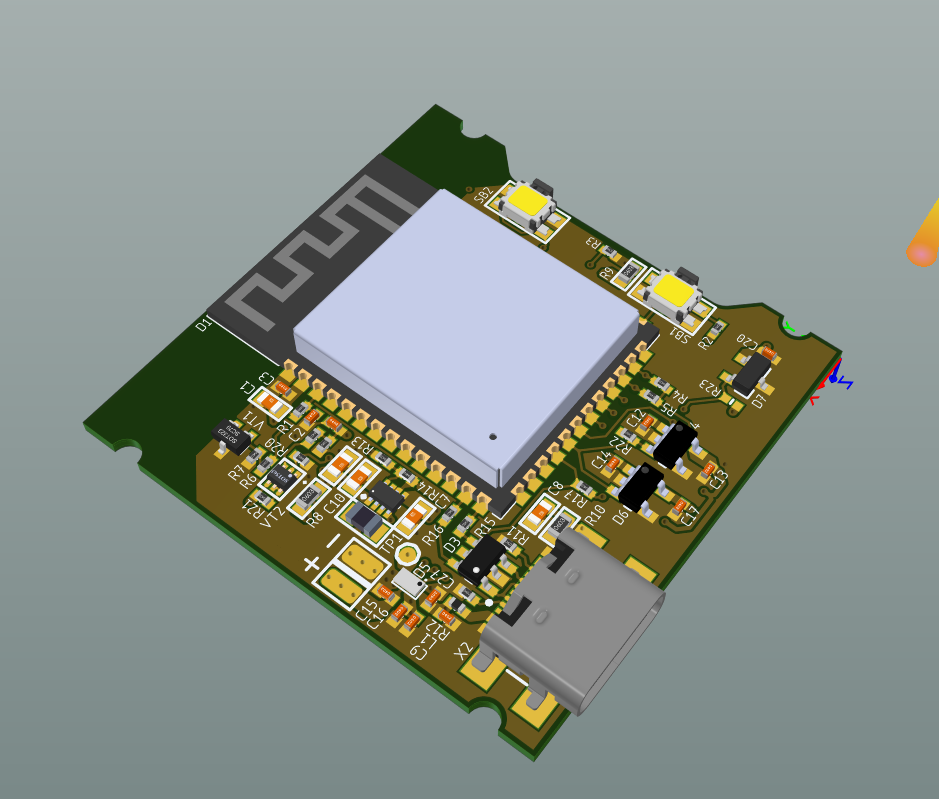
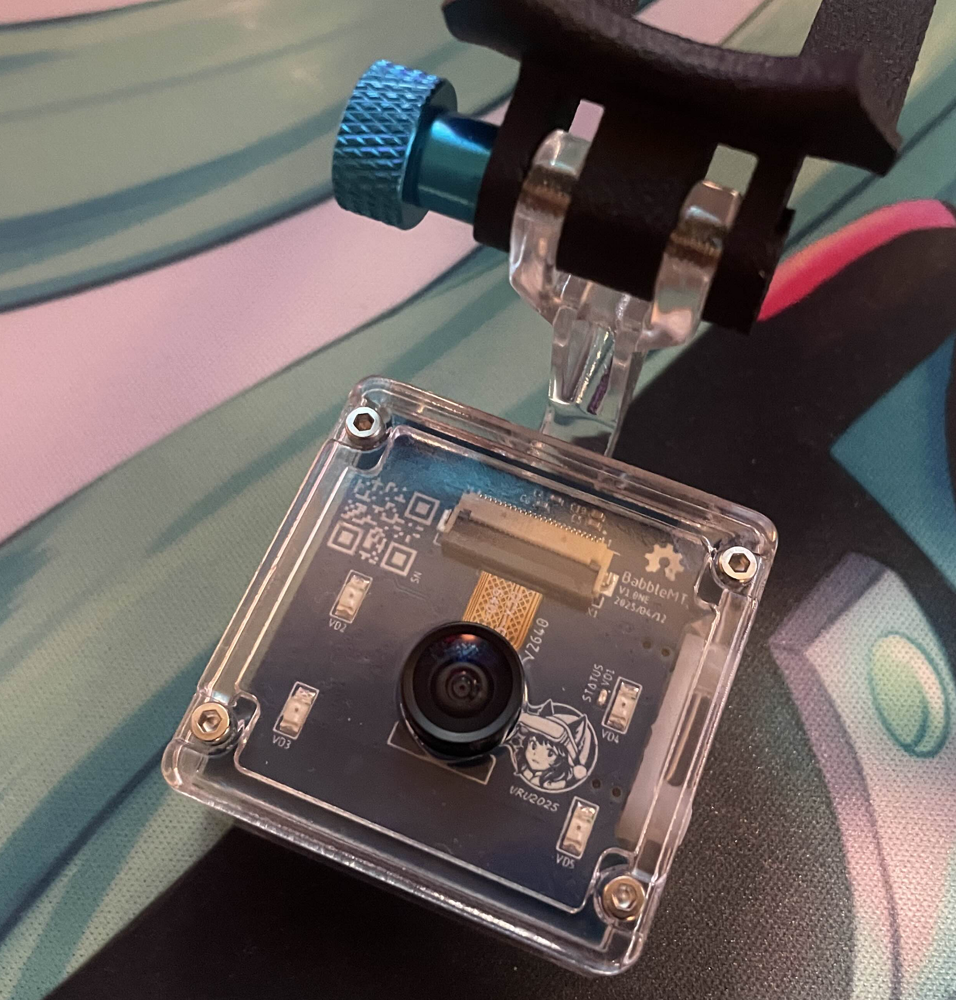
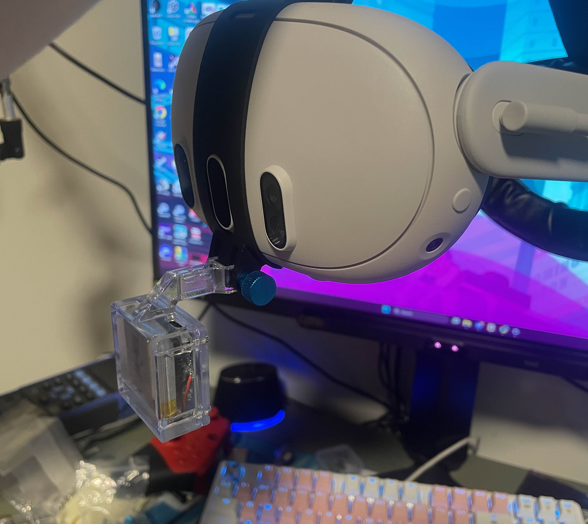

# Face Tracker Hardware Design 

An open-source hardware project for building compact face tracker based on [Babble Project](https://babble.diy/).

## 🔧 Overview

Electronics design made with Altium Designer, including schematics, layout, and manufacturing files (Gerbers, CPL, BOM). Mechanical parts designed in SolidWorks.

## 📦 Features

- Modular and compact design
- Increased power efficiency
- Could be used both in wireless and USB mode

## 🖼️ Gallery

Assembly guides will be added soon...

